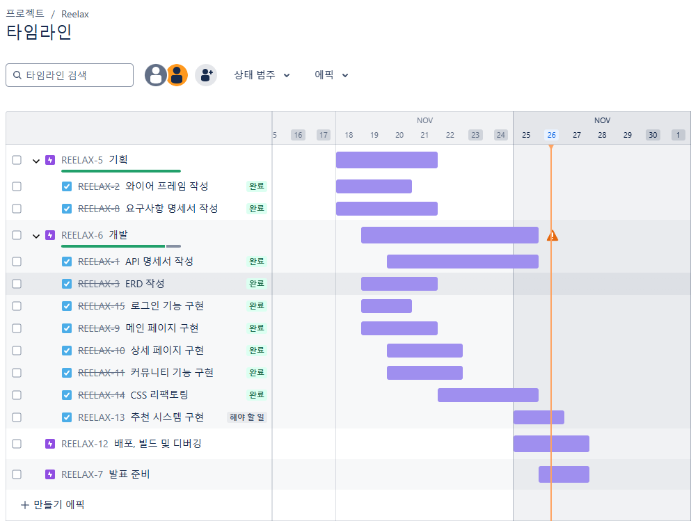
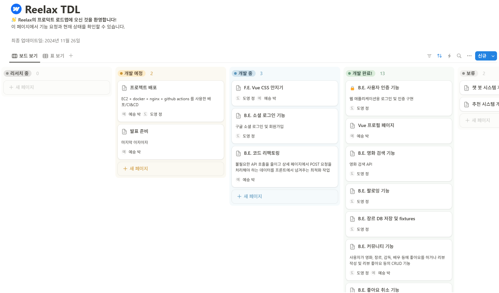
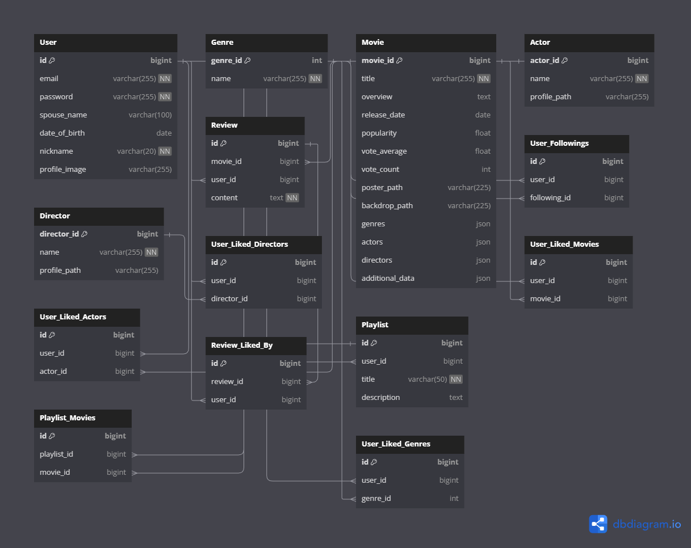
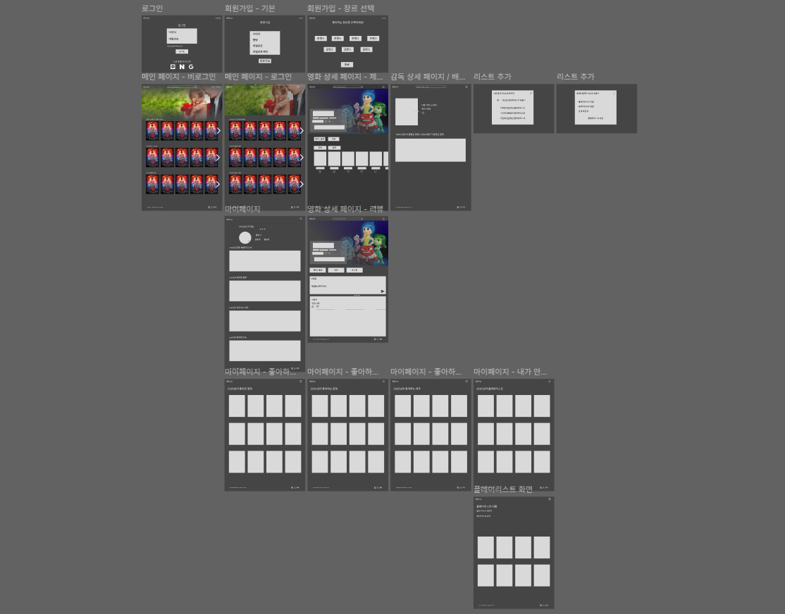
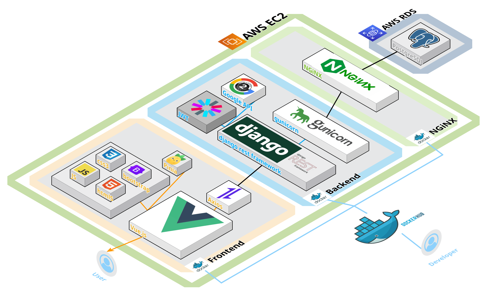
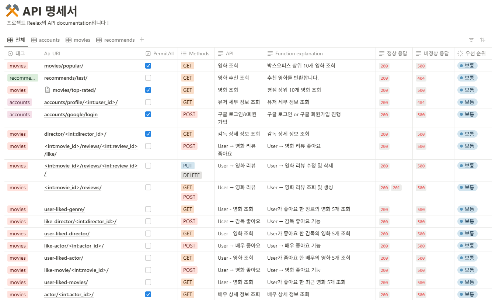

# Reelax

**영화 추천 서비스 Reelax**

배포된 링크 : http://43.203.255.151:5173/


## 🎯 프로젝트 개요

삼성 청년 SW 아카데미 12th<br>1학기 관통 프로젝트

### 📆 프로젝트 진행 기간

**2024.11.18 ~ 2024.11.27 (9일)**

### ⭐ 프로젝트 기획 배경

&nbsp;**무슨 영화**를 봐야할까 고민해보신 적 있으신가요? **영화 플레이리스트**를 만들고 싶었던 적 없었나요?

&nbsp;**Reelax**를 통해 좋아하는 장르, 배우의 영화를 추천받고 휴일의 따분함을 날려보는 건 어떨까요?

### 🚀 주요 기능

- **감독, 배우 이름, 영화 제목으로 검색**
- **사용자가 좋아하는 감독, 배우, 장르의 영화 랜덤 추천**
- **사용자가 좋아하지 않는 장르 중 하나를 선택하여 랜덤 추천**
- **영화 리뷰 작성, 수정, 삭제**
- **영화, 배우, 감독 좋아요 기능**
- **나만의 플레이리스트 만들기**
- **유저 간 팔로우, 팔로잉 기능**

### 👨‍👩‍👧‍👦 팀원 소개

<table>
  <thead>
    <tr>
      <th style="text-align: center;"><strong>BE</strong></th>
      <th style="text-align: center;"><strong>FE</strong></th>
    </tr>
  </thead>
  <tbody>
    <tr>
      <td style="text-align: center;">
        <a href="https://github.com/SorrowAddict">
          <br/>
        </a>
      </td>
      <td style="text-align: center;">
        <a href="https://github.com/Yeseung-Park">
          
        </a>
      </td>
    </tr>
    <tr>
      <td>
        <center><a href="https://github.com/SorrowAddict">정도영</a></center>
      </td>
      <td>
        <center><a href="https://github.com/Yeseung-Park">박예승</a></center>
      </td>
    </tr>
  </tbody>
</table>

* 역할 분담

    | 팀원   | 업무 내용                                                    |      |
    | ------ | ------------------------------------------------------------ | ---- |
    | 정도영 | 1. ERD 설계, 풀스택(백엔드 전반), 로그인 및 회원가입, JWT 토큰, 소셜 로그인(구글), 리뷰 댓글 추가/수정/삭제 기능, TMDB, youtube, Google Oauth API 연결, 디자인, EC2&RDS 배포 |      |
    | 박예승 | 1. ERD 설계, 풀스택(프론트엔드 전반), 영화 및 리뷰 추가/수정/삭제, 플레이리스트 기능, 리뷰 댓글 추가/수정/삭제, 마이페이지 및 다른 유저페이지 기능, 영화추천 기능, 피그마, 디자인, EC2&RDS 배포 |      |

---


## 🖥️ 주요 기술

<div>  
   
   
   
   
  
  <br>

  
  
   
  
  
  <br>

   
    
  
  
  
  
  <br>
  <br>
</div>

---

## 📆 프로젝트 일정 관리





## 🗂 ERD



## 🗂️ 프로젝트 구성

### 🎨 와이어 프레임



### 💥 시스템 아키텍처



### 📜 API 명세서



### ❓ 영화 추천 알고리즘에 대한 기술적 설명

- 사용자의 영화, 감독, 배우, 장르 경험 데이터를 기반으로 한 랜덤 선택 알고리즘
  - 발전 가능한 부분
    - TMDB data를 movie model schema에 맞게 전체 json 크롤링 데이터 획득
    - KoBERT 모델을 이용한 한국어 임베딩, 토크나이징, 벡터화를 통한 코사인 유사도를 기반으로 한 TMDB data 전체 json 파일에서 유사어를 뽑기
    - chatGPT 4o-mini model에 RAG, CoT 기법을 활용해 프롬프트 엔지니어링 + 퓨 샷 러닝을 통한 챗 봇 형태 구성

### ✅ 핵심 기능에 대한 설명

1. **Reelax는 어떤 서비스인가요?**
  - Reelax는 사용자의 취향에 맞는 영화를 추천해주는 서비스입니다. 감독, 배우, 장르 등을 기반으로 영화를 추천받을 수 있습니다.

2. **어떻게 영화를 추천받을 수 있나요?**
  - 사용자가 좋아하는 감독, 배우, 장르를 선택하면 해당 기준에 맞는 영화를 랜덤으로 추천해줍니다.

3. **플레이리스트 기능은 무엇인가요?**
  - 사용자가 좋아하는 영화를 모아 자신만의 영화 플레이리스트를 만들 수 있는 기능입니다.

4. **리뷰 작성은 어떻게 하나요?**
  - 각 영화의 상세 페이지에서 리뷰를 작성, 수정, 삭제할 수 있습니다.

5. **팔로우 기능은 무엇인가요?**
  - 다른 사용자를 팔로우하여 그들의 영화 리뷰와 플레이리스트를 확인할 수 있는 기능입니다.

### 🤖 생성형 AI를 활용한 부분

1. 코드 작성 및 학습 지원

  - ChatGPT와 Claude.ai를 활용하여 개발 중 모르는 코드나 이해가 어려운 부분에 대해 설명을 제공받아 학습하였습니다.
  - 이를 통해 Django, Vue.js와 같은 주요 프레임워크 및 라이브러리의 이해도를 높이고, 문제 해결 속도를 향상시켰습니다.

2. 개발 효율성 증대

  - 생성형 AI를 활용해 boilerplate 코드 작성과 반복적인 작업을 자동화하여 개발 시간을 단축했습니다.
  - API 설계, 에러 디버깅, 최적화 코드 추천 등을 통해 효율적인 개발 프로세스를 구현했습니다.

3. 가독성 높은 코드 작성

  - ChatGPT와 Claude.ai의 코드 리뷰 기능을 이용해 가독성을 높이는 코드 작성 방식을 학습하고 적용했습니다.
  - 함수 분리, 주석 작성, 파일 구조 최적화 등 클린 코드 작성에 필요한 팁을 반영하여 협업 효율성을 증대시켰습니다.

4. 효율적인 협업과 아이디어 도출

  - 팀 내에서 논의된 기능 구현 방안을 생성형 AI를 통해 시뮬레이션하고 최적의 방법을 찾아 적용했습니다.
  - 기술적인 딜레마와 선택지들에 대해 생성형 AI로 빠르게 피드백을 받아 결정을 내릴 수 있었습니다.

### 📁 폴더 구조

- 전반적인 프로젝트 폴더 구조
```
project/
├── .github/                       # GitHub 관련 설정 및 템플릿 파일 저장
│   ├── templates/                 # GitHub 이슈 및 PR 템플릿 폴더
│   │   ├── COMMIT_TEMPLATE.md     # 커밋 메시지 템플릿
│   │   ├── PR_TEMPLATE.md         # Pull Request 템플릿
├── backend/                       # 백엔드 코드가 저장된 폴더 (Django)
├── docs/                          # 프로젝트 문서와 관련된 자료
│   ├── CONTRIBUTE_GUIDE.md        # 기여 가이드 문서
│   └── etc/
│       └── assets/
│           └── image/             # 문서에서 참조하는 이미지 저장소
│               ├── ERD.png        # 데이터베이스 ERD 다이어그램
│               ├── frame.png      # 프로젝트의 주요 프레임워크 이미지
│               ├── image.png      # 기타 문서 이미지
│               ├── system_architecture.png # 시스템 아키텍처 다이어그램
├── frontend/                      # 프론트엔드 코드가 저장된 폴더 (Vue.js)
│   └── reelax/                    # 프론트엔드 실제 구현 코드
├── nginx/                         # Nginx 설정 파일 및 관련 구성 폴더
│   ├── nginx.conf                 # Nginx 설정 파일
│   └── docker-compose.yml         # Docker Compose 파일 (백엔드, 프론트엔드 및 Nginx 서비스 구성)
├── README.md                      # 프로젝트에 대한 소개 및 가이드 문서
```

- 백엔드 폴더 구조
```
backend/
├── accounts/               # 사용자 관리와 관련된 앱
│   ├── migrations/         # 데이터베이스 마이그레이션 파일이 저장되는 폴더
│   ├── adapters.py         # 외부 서비스와의 통합 및 연결을 담당하는 코드
│   ├── admin.py            # Django Admin에서의 사용자 관련 설정
│   ├── apps.py             # Django 앱 설정
│   ├── google_backup.py    # Google 관련 백업 기능 구현 코드
│   ├── managers.py         # 커스텀 모델 매니저 정의
│   ├── models.py           # 사용자 관련 데이터베이스 모델 정의
│   ├── serializers.py      # 사용자 관련 데이터 직렬화 및 역직렬화
│   ├── signals.py          # 사용자 관련 신호 처리 (예: 회원가입 시 후속 작업)
│   ├── tests.py            # 사용자 관련 테스트 코드
│   ├── urls.py             # 사용자 관련 URL 라우팅 설정
│   └── views.py            # 사용자 관련 뷰 로직
├── media/                  # 업로드된 파일을 저장하는 폴더 (예: 프로필 사진)
├── movies/                 # 영화 정보 관리와 관련된 앱
│   ├── migrations/         # 데이터베이스 마이그레이션 파일이 저장되는 폴더
│   ├── fixtures/           # 초기 데이터 로드에 사용되는 JSON, YAML 파일 등
│   ├── admin.py            # Django Admin에서의 영화 관련 설정
│   ├── apps.py             # Django 앱 설정
│   ├── models.py           # 영화 관련 데이터베이스 모델 정의
│   ├── serializers.py      # 영화 관련 데이터 직렬화 및 역직렬화
│   ├── tests.py            # 영화 관련 테스트 코드
│   ├── urls.py             # 영화 관련 URL 라우팅 설정
│   └── views.py            # 영화 관련 뷰 로직
├── recommends/             # 추천 시스템과 관련된 앱
│   ├── migrations/         # 데이터베이스 마이그레이션 파일이 저장되는 폴더
│   ├── admin.py            # Django Admin에서의 추천 시스템 설정
│   ├── apps.py             # Django 앱 설정
│   ├── models.py           # 추천 시스템 관련 데이터베이스 모델 정의
│   ├── tests.py            # 추천 시스템 관련 테스트 코드
│   └── views.py            # 추천 시스템 관련 뷰 로직
├── reelax/                 # 프로젝트의 메인 설정 폴더
│   ├── asgi.py             # ASGI 서버 설정 (비동기 지원)
│   ├── settings.py         # Django 프로젝트 전역 설정
│   ├── urls.py             # 프로젝트 전역 URL 라우팅 설정
│   └── wsgi.py             # WSGI 서버 설정 (배포 환경에서 사용)
├── venv/                   # 가상환경 폴더 (패키지 종속성 관리)
├── .env                    # 환경 변수 파일 (보안 정보 및 설정)
├── .gitignore              # Git에서 무시할 파일 및 폴더 목록
├── Dockerfile              # Docker 컨테이너를 위한 이미지 설정 파일
├── entrypoint.sh           # Docker 컨테이너 시작 시 실행될 스크립트
├── manage.py               # Django 프로젝트 관리 도구
└── requirements.txt        # Python 패키지 의존성 목록
````
- 프론트 폴더 구조
```
frontend/reelax/
├── node_modules/               # npm으로 설치된 패키지들이 저장되는 디렉토리
├── public/                     # 정적 파일들이 저장되는 디렉토리
│   ├── image/                  # 정적 이미지 파일
│   └── favicon.ico             # 브라우저 탭에 표시될 아이콘
├── src/                        # 소스 코드가 저장되는 디렉토리
│   ├── assets/                 # 프로젝트에서 사용되는 정적 리소스 (CSS, 이미지 등)
│   │   ├── styles/
│   │   │   └── global.css      # 글로벌 CSS 스타일 정의
│   ├── components/             # Vue 컴포넌트들이 저장되는 디렉토리
│   │   ├── MainPage/
│   │   │   └── MainCarouselSection.vue  # 메인 페이지의 캐러셀 섹션 컴포넌트
│   │   ├── Movie/
│   │   │   ├── MovieCard.vue            # 개별 영화 카드 컴포넌트
│   │   │   └── ...
│   │   ├── MovieCredit/
│   │   │   ├── ActorCreditCard.vue      # 배우의 크레딧 카드 컴포넌트
│   │   │   └── ...
│   │   ├── MovieDetailPage/
│   │   │   ├── AddPlaylistModal.vue     # 플레이리스트 추가 모달
│   │   │   └── ...
│   │   ├── MovieReview/
│   │   │   ├── MovieReview.vue          # 영화 리뷰 섹션 컴포넌트
│   │   │   └── ReviewCard.vue           # 리뷰 카드 컴포넌트
│   │   ├── MyPage/
│   │   │   ├── FollowingListModal.vue   # 팔로잉 리스트 모달 컴포넌트
│   │   │   └── FollowListModal.vue      # 팔로우 리스트 모달 컴포넌트
│   │   ├── Navbar/
│   │   │   ├── BaseNavbar.vue           # 기본 네비게이션 바
│   │   │   ├── LoginNavbar.vue          # 로그인 후 네비게이션 바
│   │   │   └── UnloginNavbar.vue        # 로그인 전 네비게이션 바
│   │   ├── Search/
│   │   │   └── SearchBar.vue            # 검색 바 컴포넌트
│   │   └── Footer.vue                   # 하단 푸터 컴포넌트
│   ├── router/                          # Vue Router 설정
│   │   └── index.js                     # 라우팅 설정 파일
│   ├── stores/                          # Pinia 스토어 디렉토리 (상태 관리)
│   │   ├── account.js                   # 사용자 상태 관리
│   │   ├── like.js                      # 좋아요 상태 관리
│   │   ├── movie.js                     # 영화 상태 관리
│   │   ├── playlist.js                  # 플레이리스트 상태 관리
│   │   ├── review.js                    # 리뷰 상태 관리
│   │   └── search.js                    # 검색 상태 관리
│   ├── views/                           # 페이지 단위의 Vue 컴포넌트
│   │   ├── ActorDetailView.vue          # 배우 상세 페이지
│   │   ├── DirecDetailView.vue          # 감독 상세 페이지
│   │   ├── GenreSelectionView.vue       # 장르 선택 페이지
│   │   ├── GoogleCallbackView.vue       # Google OAuth 콜백 페이지
│   │   ├── LoginPageView.vue            # 로그인 페이지
│   │   ├── MainPageView.vue             # 메인 페이지
│   │   ├── MovieDetailView.vue          # 영화 상세 페이지
│   │   ├── MyActorView.vue              # 나의 배우 리스트 페이지
│   │   ├── MyDirectorView.vue           # 나의 감독 리스트 페이지
│   │   ├── MyMovieView.vue              # 나의 영화 리스트 페이지
│   │   ├── MyPageView.vue               # 마이 페이지
│   │   ├── MyPlaylistDetailView.vue     # 플레이리스트 상세 페이지
│   │   ├── MyPlaylistView.vue           # 플레이리스트 페이지
│   │   ├── SearchPageView.vue           # 검색 결과 페이지
│   │   └── SignupPageView.vue           # 회원가입 페이지
│   ├── App.vue                          # Vue의 최상위 컴포넌트
│   └── main.js                          # Vue 애플리케이션 진입점
├── .env                                 # 환경 변수 파일
├── .gitignore                           # Git에서 무시할 파일 목록
├── Dockerfile                           # Docker 이미지 설정 파일
├── index.html                           # 메인 HTML 파일
├── jsconfig.json                        # JavaScript 경로 설정 파일
├── package-lock.json                    # 정확한 패키지 버전 정보
├── package.json                         # npm 패키지 및 스크립트 설정
├── README.md                            # 프로젝트 설명 파일
└── vite.config.js                       # Vite 설정 파일
```
---

## 🔍 Reelax 프로젝트 회고

Reelax 프로젝트를 진행하며 다양한 기술과 협업 방식을 경험하며 많은 것을 배웠습니다. 9일이라는 짧은 기간 동안 완성도 있는 결과물을 도출하기 위해 팀원들과 효율적인 협업과 시간 관리를 중점적으로 고려했습니다.

### 성공적이었던 점

1. 명확한 역할 분담

  - 백엔드와 프론트엔드 업무를 명확히 나누고, 각자 맡은 부분에 집중하여 높은 효율성을 유지했습니다.
  - 서로의 작업이 독립적이면서도 조화롭게 결합될 수 있도록 API 명세서를 작성하고, 개발 초반부터 지속적으로 소통했습니다.

2. 기술 스택 익히기

  - Django Rest Framework와 Vue.js를 활용하면서 기본적인 사용법을 익히고, 프로젝트에 적합한 설계와 구현 방법을 적용할 수 있었습니다.
  - Docker와 AWS 배포 과정을 처음 경험했음에도 성공적으로 서비스를 배포하며 자신감을 얻었습니다.

3. 추천 알고리즘 설계

  - 사용자 경험 데이터를 기반으로 한 간단한 랜덤 추천 알고리즘을 구현하며 추천 시스템의 기초를 이해했습니다.
  - 향후 확장 가능한 알고리즘 설계의 중요성을 깨닫고 발전 방향에 대한 아이디어도 얻을 수 있었습니다.

### 배포 서버 URL

http://43.203.255.151:5173/